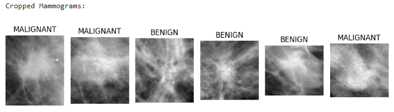

# Breast Cancer Image Classification using CNN

This repository contains a project that uses Convolutional Neural Networks (CNNs) to classify breast cancer images from the CBIS-DDSM dataset. 
The project involves data preprocessing, model training, evaluation, and visualization.

## Table of Contents

Introduction
Dataset
Installation
Usage
File Descriptions
Results
Contributing
License

## Introduction
Breast cancer is the most common cancer in women, making early detection critical. This project uses Convolutional Neural Networks (CNNs) to analyze mammogram scans and classify tumor types, aiming to improve accuracy and efficiency in breast cancer diagnosis. 
By automating the analysis process, it can reduce manual workload and the risk of human error, ultimately aiding oncology professionals in making faster and more accurate decisions.

## Dataset
The dataset used in this project is the CBIS-DDSM (Curated Breast Imaging Subset of DDSM). The dataset consists of mammography images with labels indicating the presence of benign or malignant tumors.

## Installation
To run this project, you need to have Python and the following libraries installed:

pandas
numpy
matplotlib
plotly
seaborn
OpenCV (cv2)
tensorflow
PIL (Pillow)
torchvision
torch
scikit-learn
keras
You can install the required libraries using pip:
Dependencies:
  os version: N/A
  pandas version: 2.2.2
  numpy version: 1.26.4
  seaborn version: 0.13.2
  cv2 version: 4.10.0
  tensorflow version: 2.3.0
  PIL version: 10.4.0
  keras version: 2.13.1
  glob version: N/A
  PIL version: 10.4.0

pip install pandas numpy matplotlib plotly seaborn opencv-python tensorflow pillow torchvision torch scikit-learn keras
Usage
Clone this repository:

git clone "https://github.com/PavelM90/Breast cancer Image classification using CNN. CBIS-DDSM dataset.git"
Navigate to the project directory:

Run the Jupyter Notebook:

jupyter notebook "Breast cancer Image classification using CNN. CBIS-DDSM dataset_july.ipynb"

NOTE: The dataset is too large to upload to the repo; please use this link to find the data  https://www.kaggle.com/datasets/awsaf49/cbis-ddsm-breast-cancer-image-dataset

## File Descriptions
Breast cancer Image classification using CNN. CBIS-DDSM dataset_july.ipynb: The main notebook containing the code for data preprocessing, model training, evaluation, and visualization./

## Results
The project demonstrates the use of CNNs for classifying breast cancer images. The results include accuracy, precision, recall, F1-score, and confusion matrix for the model. Visualizations of the training process and example predictions are also provided.

## Contributing
Contributions are welcome! If you have any suggestions or improvements, please create an issue or submit a pull request.

## License
This project is licensed under the MIT License - see the LICENSE file for details.
