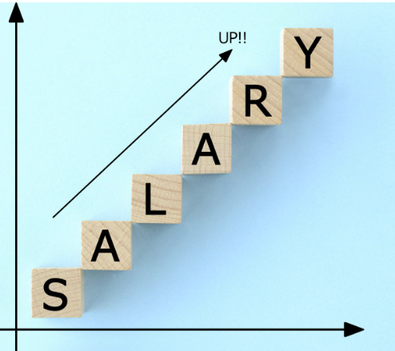

# Data Scientist Salary Prediction

This repository contains a project focused on predicting the salaries of data scientists using regression models. The project includes data preprocessing, model training, evaluation, and visualization.

## Table of Contents
Introduction
Dataset
Installation
Usage
File Descriptions
Results
Acknowledgements
Contributing
License

## Introduction
Predicting the salary of a data scientist is a valuable task for various stakeholders including job seekers, employers, and educational institutions. 
This project leverages machine learning techniques to predict salaries based on various features such as experience, education, location, and industry.

## Dataset
The dataset used in this project includes various features that influence the salary of data scientists. It is sourced from publicly available data repositories and includes features such as years of experience, education level, location, and industry.

## Installation
To run this project, you need to have Python and the following libraries installed:

pandas
numpy
matplotlib
seaborn
scikit-learn
jupyter

pandas version: 2.2.2
matplotlib version: 3.8.4
seaborn version: 0.13.2
scikit-learn version: 1.4.2
xgboost: 2.0.3

You can install the required libraries using pip:

Copy code
pip install pandas numpy matplotlib seaborn scikit-learn jupyter
Usage
Clone this repository:

Copy code
git clone "https://github.com/PavelM90/Data Scientists Salary Prediction Using Regression Models.git"

Navigate to the project directory:

Copy code
cd data-scientist-salary-prediction
Open the Jupyter Notebook:

Copy code
jupyter notebook "Data Scientists Salary Prediction Using Regression Models.ipynb"
File Descriptions
Data Scientists Salary Prediction Using Regression Models.ipynb: The main notebook containing the code for data preprocessing, model training, evaluation, and visualization.
images/: Directory containing images used in the project, including the banner.
Results
The project demonstrates the use of regression models to predict data scientist salaries. The results include visualizations of the data, model performance metrics, and insights gained from the analysis.

## Contributing
Contributions are welcome! If you have any suggestions or improvements, please create an issue or submit a pull request.

## License
This project is licensed under the MIT License - see the LICENSE file for details.

