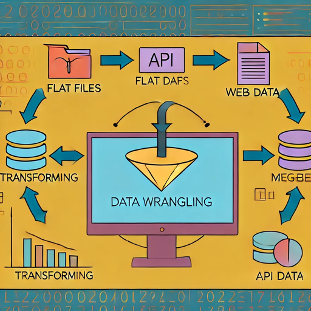

# Socio-Demographic Data Project for Massachusetts
## Overview
This project focuses on the extraction, preparation, and combination of socio-demographic data for the state of Massachusetts from various sources. The primary goal is to compile a comprehensive SQL database from data obtained through flat files, web scraping, and API sources.

## Project Structure
The project is organized into several stages, each documented with corresponding Jupyter notebooks:

## Data Extraction

### Flat Files: Extraction and preparation of data from flat files.
### Web Scraping: Extraction of data from web sources.
### API Integration: Extraction of data from API sources.

 
## Data Preparation

Cleaning and preprocessing data from various sources.
Combining the prepared data into a cohesive dataset.
Database Creation

Combining all the data into a SQL database for efficient storage and querying.
## Files and Notebooks

1. Data Extraction
a. Flat Files
File: Data Wrangling Project Part 1 Flat File preparation.ipynb
Description: This notebook covers the extraction and preparation of data from flat files, including loading data, cleaning, and preliminary analysis.

b. Web Scraping
File: Datra Wrangling Projects Part 2 Web scraping.ipynb
Description: This notebook focuses on extracting data from web sources using web scraping techniques. It includes scripts for scraping relevant socio-demographic data and processing it for further analysis.

c. API Integration

File: Data Wrangling Projects Part 3 Data Extraction from API source.ipynb
Description: 
This notebook involves extracting data from various APIs, processing the responses, and preparing the data for integration with other sources.

2. Data Preparation

a. Data Combination
File: Data Wrangling - Combination of the sources.ipynb
Description: This notebook demonstrates the process of combining data from flat files, web scraping, and API sources into a single dataset. It includes data cleaning, transformation, and merging steps.

3. Database Creation
Description: Creation of a SQL database to store the combined dataset, allowing for efficient querying and retrieval of socio-demographic data.

## Usage

Run the Notebooks: Execute each Jupyter notebook in the order mentioned above to perform data extraction, preparation, and combination.
Create the Database: Use the combined data to create a SQL database, as detailed in the final notebook.

## Requirements
Python 3.x
Jupyter Notebook
Libraries: pandas, numpy, requests, beautifulsoup4, sqlalchemy, and others as specified in the notebooks

## Conclusion
This project provides a comprehensive workflow for building a socio-demographic database for Massachusetts using data from various sources. By following the steps outlined in the notebooks, you can extract, prepare, and combine data, and store the results in a SQL database for further analysis.
