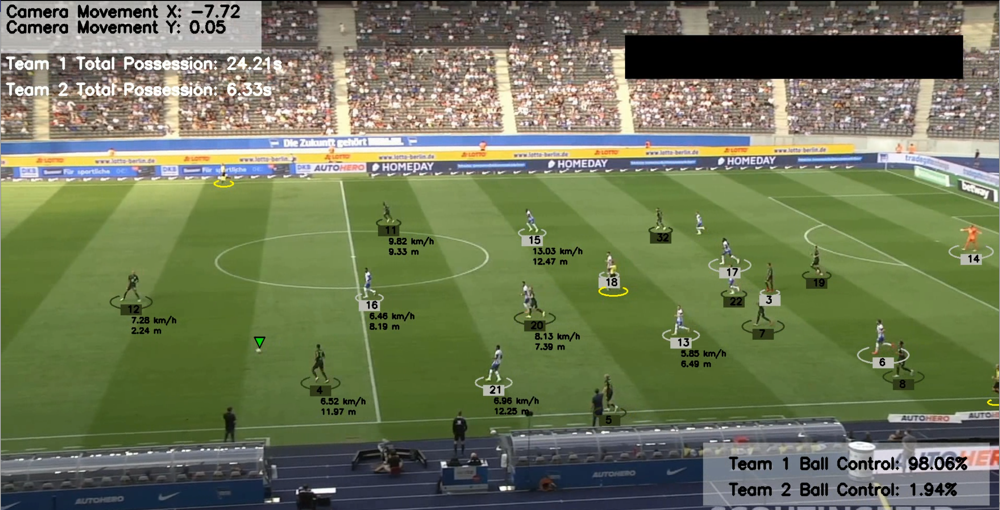

## Football Match Analytics
  This repository contains a project that utilizes computer vision and machine learning to analyze football match videos. The project focuses on real-time analytics such as ball possession percentage, player speed, ball tracking, and team possession using Convolutional Neural Networks (CNNs) and other ML techniques.
  Modern professional sports are highly competitive, relying heavily on deep analysis of past games for better preparation. 
  This project aims to create a tool that displays on-screen analytics for soccer matches, enhancing the precision, depth, and accessibility of soccer analytics through computer vision and machine learning.

## Table of Contents
  Introduction
  Installation
  Usage
  Directory Structure
  File Descriptions
  Results
  Contributing
  License
  Introduction

## Installation
  To run this project, you need to have Python and the following libraries installed:

  numpy
  opencv-python
  tensorflow
  pillow
  scikit-learn
  os
  sys
  ultrlytics
  pickle
  matplotlib
  pytotch
  pandas

  You can install the required libraries using pip:

  pip install numpy opencv-python tensorflow pillow scikit-learn torch pickle matplotlib pandas

## Usage
  Clone this repository:

  Copy code
  git clone https://github.com/PavelM90/-Projects/tree/main/Football_match_analytics.git
  Navigate to the project directory:

  Copy code
  cd football-match-analytics
  Place your input videos in the input_videos directory.

## Run the main script:

  Copy code
  python main.py
## Directory Structure

football-match-analytics/
├── main.py
├── Object_Detection.ipynb
├── input_videos/
│   └── input_video.mp4
├── output_videos/
│   └── output_video.avi
├── development_and_analysis/
│   ├── color_assignment.ipynb
│   └── Football_Analysis_Images.ipynb
├── trackers/
│   ├── tracker.py
│   └── __init__.py
├── stubs/
├── camera_movement/
│   ├── camera_movement_estimator.py
│   └── __init__.py
├── utils/
│   ├── video_utils.py
│   ├── bound_box_utils.py
│   └── __init__.py
├── player_ball_assignment/
│   ├── player_ball_assignment.py
│   └── __init__.py
├── team_color_assignment/
│   ├── color_assignment.py
│   └── __init__.py
├── view_transformer/
│   ├── view_transformer.py
│   └── __init__.py
├── speed_and_ball_estimator/
│   ├── speed_and_ball_estimator.py
│   └── __init__.py
├── models/
│   ├── best.pt
│   └── last.pt
├── images/
│   └── example.png

NOTE: best and last models were trained and saved using google colab with the resource of GPU hardware. You can use the trained model or re-train your own.

## File Descriptions
  Object_Detection.ipynb: Jupyter notebook for image analysis and visualization related to football match analytics. This notebook contains code and visualizations for analyzing images extracted from football match videos, including player and ball tracking, team color assignment, and other relevant visual analytics.
  main.py: The main script contains the code for reading video, tracking objects, estimating camera movement, transforming views, estimating speed and distance, assigning teams, calculating possession time, and saving the output video.
  input_videos/: Directory to place the input video files.
  output_videos/: Directory where the output video with analytics overlay will be saved.
  color_assign.py: Jupyter notebook for developing and testing the color assignment of players' jerseys.
  Football_Analysis_Images.ipynb: Jupyter notebook for image analysis and visualization related to football match analytics.
  tracker.py: Python script containing the implementation of tracking algorithms for players and ball.
  bound_box_utils.py: Python script containing utility functions for handling bounding boxes in video frames.
  video_utils.py: Python script containing utility functions for video processing tasks.
  player_ball_assignment.py: Python script for assigning the ball to players based on their positions.
  speed_and_distance_estimator.py: Python script for estimating the speed and distance traveled by players and visualizing this information on the video.

  
## Results

  The project provides real-time analytics for soccer matches, including ball possession percentage, player speed, ball tracking, and overall team possession. The output video will have annotations displaying these metrics.
  

## Contributing
  Contributions are welcome! If you have any suggestions or improvements, please create an issue or submit a pull request.

## License
  This project is licensed under the MIT License - see the LICENSE file for details.
