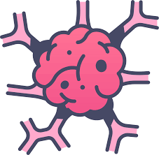

# Wisconsin Breast Cancer Classification Model

Project Overview
This project involves building a machine learning classification model using Linear Regression, Random Forest and XGBoost algorithms to predict whether a given breast cancer sample is benign or malignant based on features derived from a nuclei characteristic. 
The dataset used is the Wisconsin Breast Cancer Dataset, which is publicly available and widely used for research and educational purposes. 
The model developed in this project aims to offload the manual labor involved in reviewing patients' analyses and test results by classifying tumors as malignant or benign. 
This supervised machine learning model can assist in the automated detection of breast cancer based on blood and cell analysis results, providing oncologists with a tool to support the detection of breast cancer and minimize human involvement, thus reducing the possibility of human errors.

## Dataset
The dataset consists of 32 features computed from nuclei characteristics and a target variable (diagnosis) indicating whether the tumor is benign (B) or malignant (M). The features include:
0   id                       569 non-null    int64  
 1   diagnosis                569 non-null    object 
 2   radius_mean              569 non-null    float64
 3   texture_mean             569 non-null    float64
 4   perimeter_mean           569 non-null    float64
 5   area_mean                569 non-null    float64
 6   smoothness_mean          569 non-null    float64
 7   compactness_mean         569 non-null    float64
 8   concavity_mean           569 non-null    float64
 9   concave points_mean      569 non-null    float64
 10  symmetry_mean            569 non-null    float64
 11  fractal_dimension_mean   569 non-null    float64
 12  radius_se                569 non-null    float64
 13  texture_se               569 non-null    float64
 14  perimeter_se             569 non-null    float64
 15  area_se                  569 non-null    float64
 16  smoothness_se            569 non-null    float64
 17  compactness_se           569 non-null    float64
 18  concavity_se             569 non-null    float64
 19  concave points_se        569 non-null    float64
 20  symmetry_se              569 non-null    float64
 21  fractal_dimension_se     569 non-null    float64
 22  radius_worst             569 non-null    float64
 23  texture_worst            569 non-null    float64
 24  perimeter_worst          569 non-null    float64
 25  area_worst               569 non-null    float64
 26  smoothness_worst         569 non-null    float64
 27  compactness_worst        569 non-null    float64
 28  concavity_worst          569 non-null    float64
 29  concave points_worst     569 non-null    float64
 30  symmetry_worst           569 non-null    float64
 31  fractal_dimension_worst  569 non-null    float64
 32  Unnamed: 32              0 non-null      float64

Getting Started
Prerequisites
To run this project, you need to have the following installed:

•	Python 3.x

•	Jupyter Notebook

•	Required Python libraries – pandas, seaborn, matplotlib, numpy, Sklearn, xgboost, joblib

Dependencies:

 pandas version: 2.2.2
 
 seaborn version: 0.13.2
 
 numpy version: 1.26.4
 
 scikit-learn version: 1.4.2
 
 xgboost version: 2.0.3
 

Run Breast Cancer Classification Model - Wisconsin Data Set.ipynb

## Results
The final model achieves an accuracy of 0.98% on the test set, with precision 0.98, recall 0.96, and F1-score 0.97. Detailed results and visualizations can be found in the Breast Cancer Classification Model - Wisconsin Data Set.ipynb notebook or in the white paper in the folder provided in the  Links section
Contributing
Contributions are welcome! Please feel free to submit a Pull Request or open an Issue to discuss any changes or improvements.

## Links
https://github.com/PavelM90/-Projects/tree/35099beed16a0ba47a4165222851987e3d0901fd/Wisconsin%20Breast%20Cancer%20Classification%20Model
https://www.kaggle.com/datasets/uciml/breast-cancer-wisconsin-data

## License
This project is licensed under the MIT License.  

## Acknowledgements

•	The dataset used in this project is publicly available from the UCI Machine Learning Repository.

•	Special thanks to the contributors of the dataset and the machine learning community.
